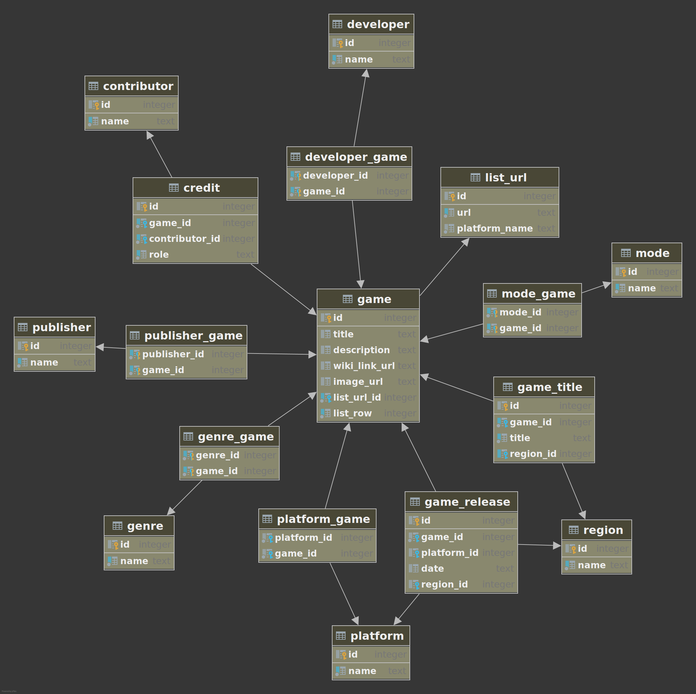

# wikivgdb

Generates a SQLite database from video game pages on
Wikipedia.

btw this is totally hideous, but what do you expect trying to parse
HTML into a relational database?

## But why?
I like video games and I like databases, and nothing seems to exist
that's not behind an API wall. I wanted to download SQL and play
around with stuff, not craft cURL commands.

Other places like Mobygames or GameFAQs have similar and/or more
complete data (Wikipedia often cites those sites) but, that's just
HTML. And also, presumably, they wouldn't enjoy me scraping the
hell out of their website and dumping it on the Internet. But
Wikipedia is free for all mankind or whatever.

There are other things like Wikidata, which seemed promising, but
the more convenient formats (e.g. JSON) were generally incomplete
and didn't totally correlate with their sister Wikipedia articles.
The RDF format seemed to be better but it was heavily normalized
and I didn't really want to make like 200 HTTP requests for
each game.

And lastly, the HTML for these Wikipedia articles will always be
available, and will be continuously updated so the database can
always be regenerated to get the latest data.

The one caveat of course is that the data might be complete and
utter garbage, or my regular expressions are highly irregular and
don't do the job properly.

But it was pretty fun to play around with for a hot minute.

## Usage
The database is checked in here at `./wikivgdb.sqlite`. To use it:

1. [Download SQLite](https://sqlite.org/download.html) and install it
2. Run `sqlite3 ./wikivgdb.sqlite`
3. Run queries

To generate the database:

1. `npm install`
2. Run `node run.js`


Database will be generated at `./wikivgdb.sqlite`. CSVs will be in
`./dist`.

To run the tests run `npm test`.

The first time you run the generator for a particular game
it will download the HTML to the `./html` folder. Subsequent
generations will reuse the local HTML.

## ERD


## Sample queries
```sqlite
-- all platforms with game count
select
	p.name,
    count(*) count,
	max(g.title_na) game,
	max(g.wiki_link_url) link
from platform p
inner join platform_game pg
	on pg.platform_id = p.id
inner join game g
	on g.id = pg.game_id
group by 1
order by 2 desc, 1;
```

```sqlite
-- get a bunch of info for all games matching a specific genre
select
    g.id,
	g.title_na as title,
	max(gr.date) as latest_release,
    group_concat(distinct p.name) as publishers,
    group_concat(distinct d.name) as developers,
    group_concat(distinct ge.name) as genres,
    group_concat(distinct m.name) as modes
from game g
inner join (
	select
		genre_game.game_id
	from genre_game
	inner join genre
	    on genre_game.genre_id = genre.id
	where genre.name = 'Simulation'
) filtered_games
	on filtered_games.game_id = g.id
left outer join publisher_game pg
	on pg.game_id = g.id
left outer join publisher p
	on p.id = pg.publisher_id
left outer join developer_game dg
	on g.id = dg.game_id
left outer join developer d
	on dg.developer_id = d.id
left outer join genre_game gg
	on g.id = gg.game_id
left outer join genre ge
	on gg.genre_id = ge.id
left outer join mode_game mg
	on g.id = mg.game_id
left outer join mode m
	on mg.mode_id = m.id
left outer join game_release gr
    on gr.game_id = g.id
group by 1, 2
order by 3 desc, 2;
```
